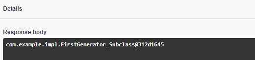

= Отчет по лабораторной работе 5
Студентов группы ПИМ-21 Бубенцова С.А. Носкова И.А.
:figure-caption: Рисунок
:listing-caption: Листинг
:source-highlighter: coderay

== 1 Постановка задачи
В процессе выполнения лабораторной работы необходимо выполнить следующие задачи:

. Реализовать внедрение зависимостей в контейнере quarkus.
. Вывести все доступные реализации для созданного интерфейса в рамках di-контейнера.

== 2 Выполнение

=== 2.1 Структура проекта

.Структура проекта

image::image/struct.jpg[]

=== 2.2 Задание
Был разработан интерфейс и две его реализации. Для первой реализации был создан qualifier, вторая реализация вызывается по-умолчанию.
Первая реализация используется для генерации восьмизначного случайного числа. Вторая реализация генерирует пятизначное случайное число.

.Листинг интерфейса
[source, java]
----
package com.example.interfaces;

public interface NumberGenerator {
    String generateNumber();
}

----

.Листинг первой реализации
[source, java]
----
package com.example.impl;

import com.example.qualifies.Digits;
import com.example.qualifies.NumberOfDigits;
import com.example.interfaces.NumberGenerator;
import org.apache.commons.lang3.RandomStringUtils;

import javax.enterprise.context.ApplicationScoped;

@NumberOfDigits(Digits.EIGHT)
@ApplicationScoped
public class FirstGenerator implements NumberGenerator {

    @Override
    public String generateNumber() {
        return RandomStringUtils.random(8, false, true);
    }
}

----

.Листинг второй реализации
[source, java]
----
@Default
@ApplicationScoped
public class SecondGenerator implements NumberGenerator {

    @Override
    public String generateNumber() {
        return RandomStringUtils.random(5, false, true);
    }
}

----

.Листинг qualifier'а
[source, java]
----
package com.example.qualifies;

import javax.inject.Qualifier;
import java.lang.annotation.Retention;
import java.lang.annotation.Target;

import static java.lang.annotation.ElementType.*;
import static java.lang.annotation.RetentionPolicy.RUNTIME;

@Qualifier
@Retention(RUNTIME)
@Target({FIELD, TYPE, METHOD})
public @interface NumberOfDigits {
    Digits value();
}
----

.Вызов первой реализации интерфейса
[source, java]
----
    @Inject @NumberOfDigits(Digits.EIGHT)
    NumberGenerator generatorEight;

    @GET
    @Produces(MediaType.TEXT_PLAIN)
    @Path("/callEight")
    public String callGeneratorEight() {
        return generatorEight.generateNumber();
    }
----

.Вызов второй реализации интерфейса
[source, java]
----
    @Inject
    NumberGenerator generatorFive;

    @GET
    @Produces(MediaType.TEXT_PLAIN)
    @Path("/callFive")
    public String callGeneratorFive() {
        return generatorFive.generateNumber();
    }
----

Далее был создан метод, который выводит все реализации bean'а.

.Листинг метода getImpl.
[source, java]
----
    @GET
    @Produces(MediaType.TEXT_PLAIN)
    @Path("/getImpl")
    public String getImpl() {
        StringBuilder sb = new StringBuilder();
        for (NumberGenerator generator: generators) {
            sb.append(generator.toString());
        }
        return sb.toString();
    }
----

== 3 Результаты выполнения

В результате выполнения задания была вызвана первая реализация разработанного интерфейса. Для неё был создан отдельный qualifier. Было выведено восьмизначное случайное число.

.Результат вывода

Далее, вызвалась вторая реализация интерфейса. Было выведено пятизначное случайное число.

.Результат вывода
image::image/image 1.png[]

Был вызван метод для вывода всех реализаций созданного интерфейса.

.Результат вызова метода для первой реализации

.Результат вызова метода для второй реализации

== Вывод
В результате выполнения лабораторной работы мы познакомились с внедрением зависимостей, на примере внедрения зависимостей в контейнере quarkus.